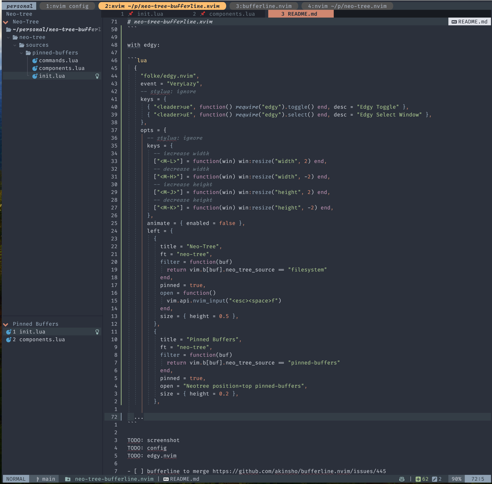

# neo-tree-bufferline.nvim

Status: usable but not complete

show pinned buffers as a neo-tree panel

Via lazy.nvim:

```lua
  {
    -- "nvim-neo-tree/neo-tree.nvim",
    dir = "~/personal/neo-tree.nvim",
    branch = "v3.x",
    dependencies = {
      "nvim-lua/plenary.nvim",
      "nvim-tree/nvim-web-devicons", -- not strictly required, but recommended
      "MunifTanjim/nui.nvim",
      "3rd/image.nvim",              -- Optional image support in preview window: See `# Preview Mode` for more information
      "jackielii/neo-tree-bufferline.nvim"
    },
    cmd = "Neotree",
  }
```



with edgy:

```lua
  {
    "folke/edgy.nvim",
    event = "VeryLazy",
    -- stylua: ignore
    keys = {
      { "<leader>ue", function() require("edgy").toggle() end, desc = "Edgy Toggle" },
      { "<leader>uE", function() require("edgy").select() end, desc = "Edgy Select Window" },
    },
    opts = {
      -- stylua: ignore
      keys = {
        -- increase width
        ["<M-L>"] = function(win) win:resize("width", 2) end,
        -- decrease width
        ["<M-H>"] = function(win) win:resize("width", -2) end,
        -- increase height
        ["<M-J>"] = function(win) win:resize("height", 2) end,
        -- decrease height
        ["<M-K>"] = function(win) win:resize("height", -2) end,
      },
      animate = { enabled = false },
      left = {
        {
          title = "Neo-Tree",
          ft = "neo-tree",
          filter = function(buf)
            return vim.b[buf].neo_tree_source == "filesystem"
          end,
          pinned = true,
          open = function()
            vim.api.nvim_input("<esc><space>f")
          end,
          size = { height = 0.5 },
        },
        {
          title = "Pinned Buffers",
          ft = "neo-tree",
          filter = function(buf)
            return vim.b[buf].neo_tree_source == "pinned-buffers"
          end,
          pinned = true,
          open = "Neotree position=top pinned-buffers",
          size = { height = 0.2 },
        },

	...
```

- [ ] empty pinned buffers seems to still display a line
- [x] ~~bufferline to merge https://github.com/akinsho/bufferline.nvim/pull/858.~~ Using monkey patch for now
- [x] numbering not correct. Probably need to pull bufferline state
- [ ] removing buffer not refreshing or maybe we want to keep it?
- [x] order not updating when moving buffer
